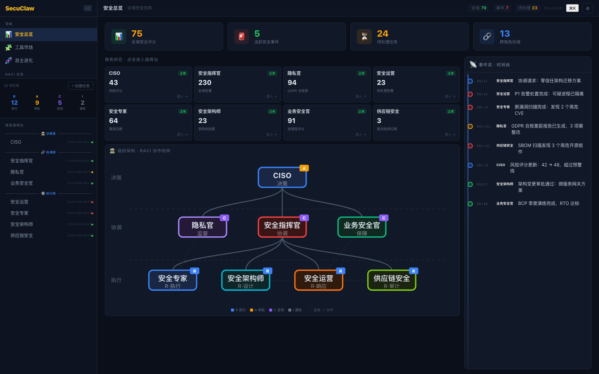
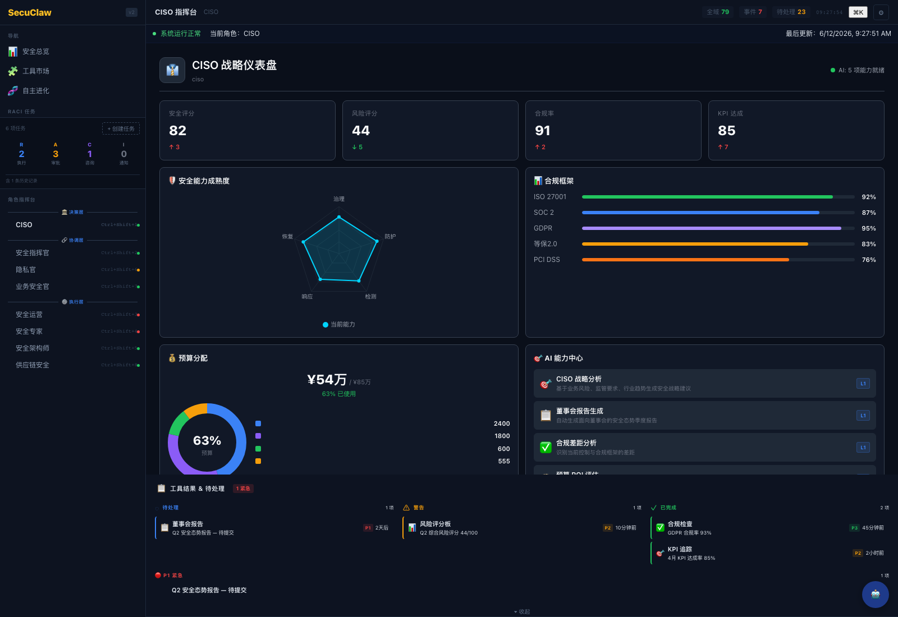
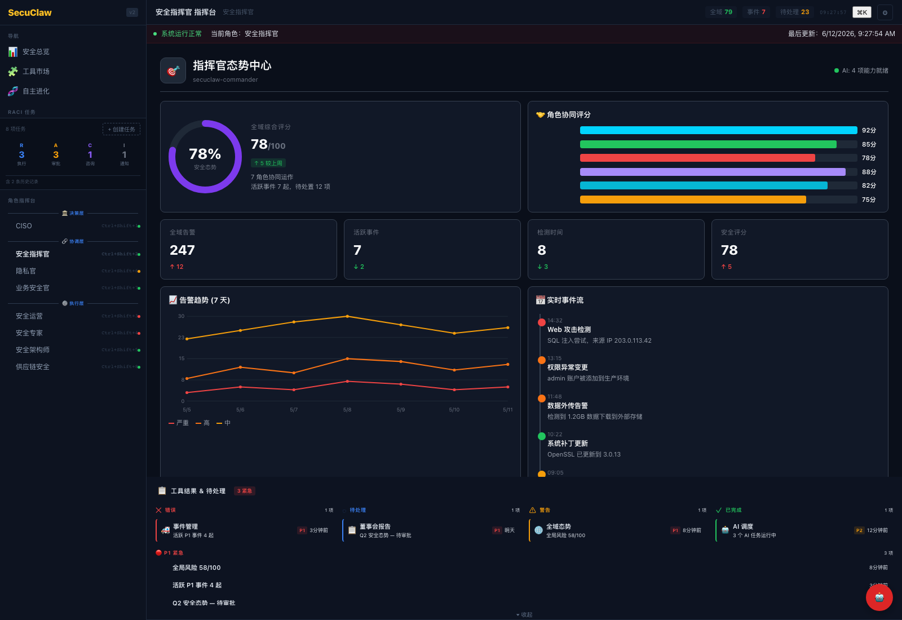
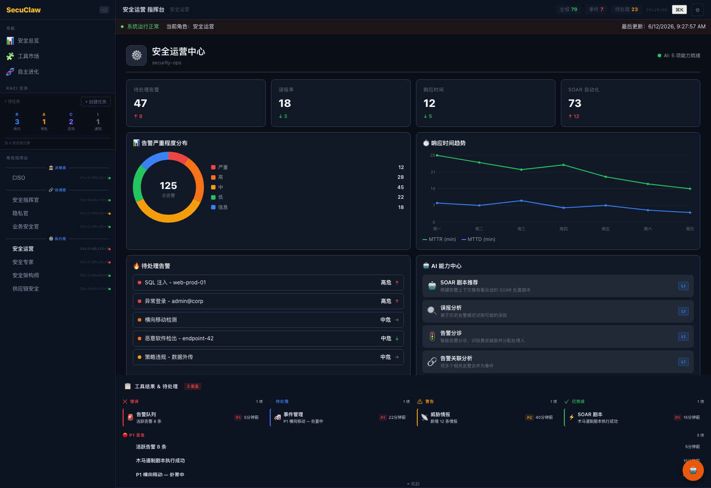
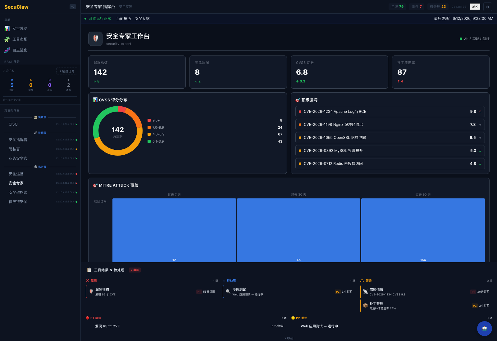
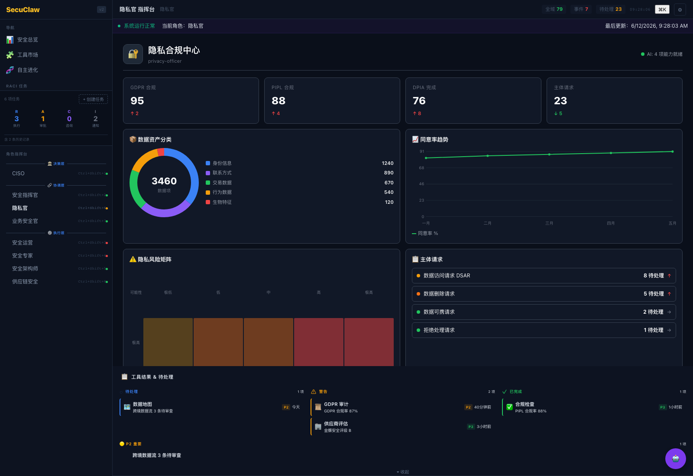
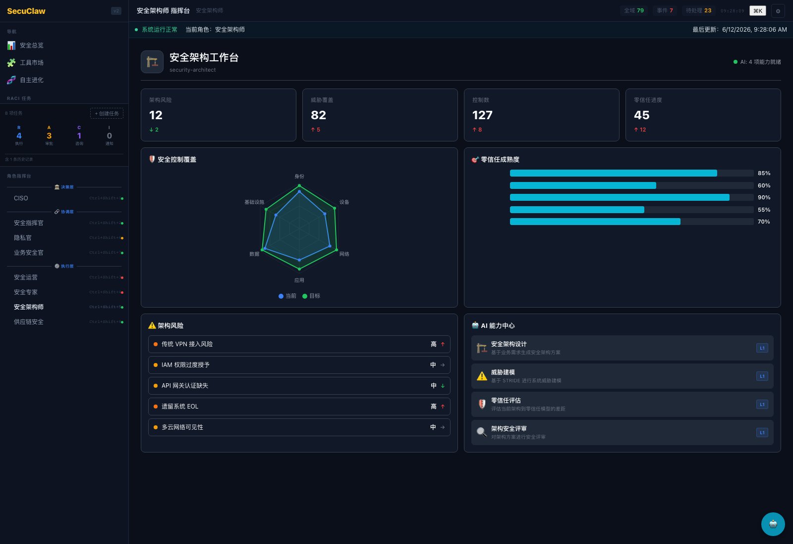
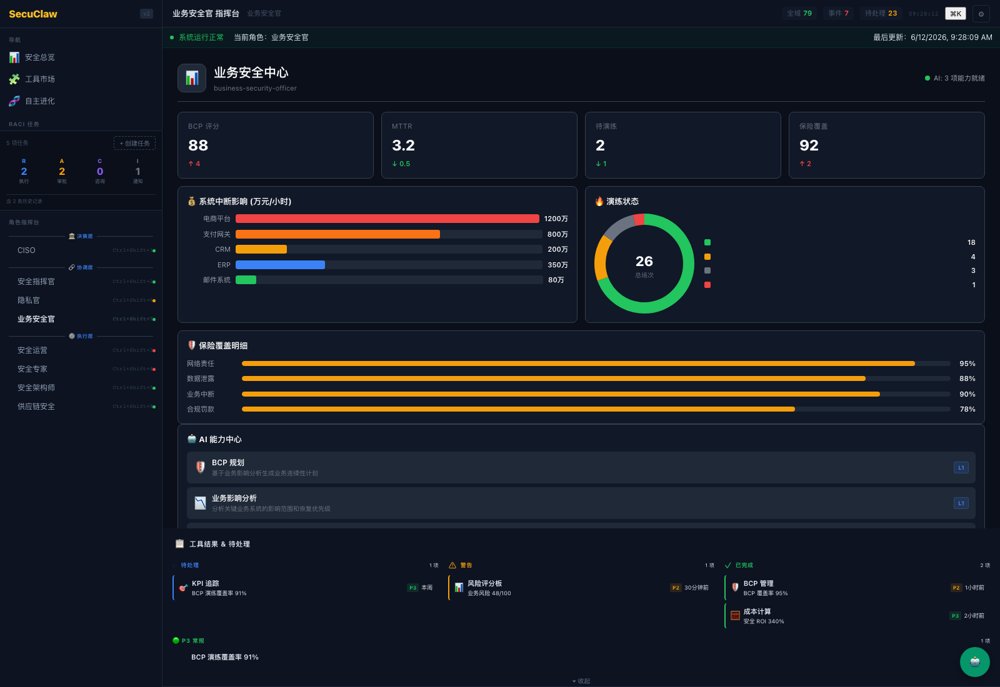
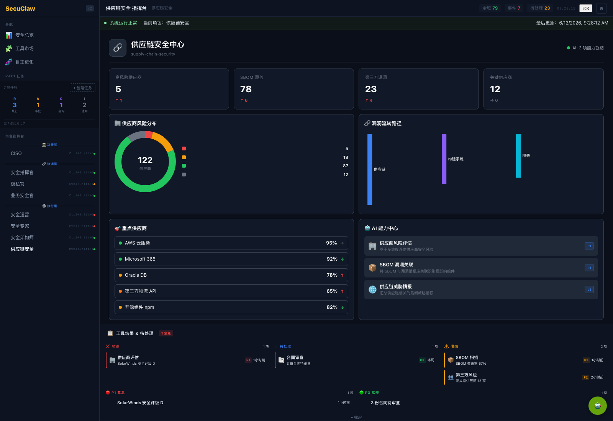

# SecuClaw — AI 安全决策辅助平台

> AI-powered Security Decision Support Platform — 让 7 类安全角色在统一指挥台下协作决策

SecuClaw 不是 SIEM/SOAR 的替代品，而是它们的**决策辅助层**。我们与 Splunk、Sentinel、ServiceNow 等平台协同，通过 AI 能力中心 + 角色仪表盘 + 实时事件流 + RACI 协调矩阵，帮助 CISO、指挥官、运营、专家、隐私、架构、业务、供应链等不同角色在同一界面下做出一致、可追溯的决策。

## 核心能力

- 8 个角色仪表盘 — 每个角色看到自己的指标、待办、AI 能力
- 30+ AI 能力 — L0/L1/L2 三级自主度（人工 / 辅助 / 监督），覆盖战略分析、事件响应、漏洞优先级、合规差距、隐私评估、威胁建模、零信任评估、BCP 规划、供应商风险等
- 统一指挥台 — 安全态势、AI 能力中心、实时事件流、角色协同评分
- 8 个角色 RACI 协调矩阵 — 决策 / 协调 / 执行 三层链路可视化
- 完整组件库 — 16 个可视化组件（雷达/饼/柱/线/热力/桑基/风险矩阵等）+ 8 个 AI 结果展示组件
- 大模型集成 — 后端对接 BigModel / OpenAI / 自定义 LLM，提供 prompt 模板系统

## 界面预览

### 总览 — 跨角色态势



8 个角色 KPI 卡片、RACI 协作矩阵、事件流时间线。

### CISO — 战略仪表盘



KPI / 安全能力成熟度雷达 / 合规框架追踪 / 预算分配甜甜圈 / 顶级风险 / AI 能力中心。

### 安全指挥官 — 态势中心



全域综合评分 / 角色协同评分 / 7 日告警趋势 / 实时事件流 / 协调优先事项。

### 安全运营 — 告警中心



告警分布甜甜圈 / MTTR/MTTD 趋势线 / 待处理告警优先级列表 / SOAR 自动化率。

### 安全专家 — 漏洞工作台



漏洞 CVSS 分布 / 顶级漏洞 / MITRE ATT&CK 阶段热力图。

### 隐私官 — 合规中心



GDPR/PIPL 合规率 / 数据资产分类 / 同意率趋势 / 隐私风险矩阵 / 主体请求队列。

### 安全架构师 — 架构工作台



安全控制覆盖雷达 / 零信任成熟度 / 架构风险。

### 业务安全官 — 业务连续性



BCP 评分 / 系统中断影响 / 演练状态 / 保险覆盖明细。

### 供应链安全 — 供应链风险



供应商风险分布 / 漏洞流转桑基图 / 重点供应商。

## 技术栈

| 层 | 技术 |
|----|------|
| **前端** | TypeScript · Lit Web Components · Vite · CSS 自定义属性 |
| **后端** | Bun · Elysia · WebSocket Gateway · JsonStore |
| **AI** | BigModel (GLM) · OpenAI 兼容 API · 31 个 Prompt 模板 |
| **可视化** | 16 个自研图表组件（雷达/饼/柱/线/热力/桑基/风险矩阵等） |
| **设计** | 8 套角色主题 · 100+ 设计 Token · 完整暗色模式 |

## 项目结构

```
secuclaw/
├── packages/core/                  # 后端 — Bun + Elysia + JsonStore
│   ├── src/ai/                    # AI 能力服务 + 31 个 prompt 模板
│   ├── src/gateway/               # WebSocket / HTTP 网关 + 路由
│   ├── src/capabilities/          # 业务能力注册中心
│   ├── data/storage/              # JsonStore 数据
│   └── ...
├── ui/                            # 前端 — Lit Web Components
│   ├── src/components/
│   │   ├── dashboards/            # 9 个角色仪表盘（ciso/commander/secops/...）
│   │   ├── visualizations/        # 16 个图表组件
│   │   ├── ai-results/            # 8 个 AI 结果展示组件
│   │   ├── role-commander/        # 角色指挥台容器
│   │   └── tool-panels/           # 工具面板
│   ├── src/config/                # 角色配置 + mock 数据
│   └── src/styles/                # 全局样式 + 8 套角色主题
├── docs/                          # 设计文档 + 截图
└── scripts/                       # 工具脚本
```

## 快速开始

### 前置要求
- Node.js ≥ 20
- pnpm ≥ 9
- Bun ≥ 1.1

### 启动开发环境
```bash
pnpm install
pnpm run dev
```

访问 http://localhost:3200

### 配置 LLM
在 `packages/core/data/storage/llm/providers.json` 中配置：
```json
{
  "bigmodel": {
    "apiKey": "your-key",
    "baseUrl": "https://open.bigmodel.cn/api/paas/v4",
    "defaultModel": "glm-5-turbo"
  }
}
```

## 角色与能力映射

| 角色 | 仪表盘 | 关键能力 | 自动度 |
|------|--------|----------|--------|
| CISO 战略官 | 战略仪表盘 | 战略分析、董事会报告、合规差距、预算 ROI | L1 辅助 |
| 安全指挥官 | 态势中心 | 全域研判、事件协调、优先级排序、资源调度 | L1 辅助 |
| 安全运营 | 告警中心 | SOAR 剧本、误报分析、告警分诊、告警关联、威胁狩猎 | L1 辅助 |
| 安全专家 | 漏洞工作台 | 漏洞优先级、渗透规划、漏洞利用分析 | L1 辅助 |
| 隐私官 | 合规中心 | DPIA 评估、DSR 处理、数据泄露评估、同意管理 | L1 辅助 |
| 安全架构师 | 架构工作台 | 架构设计、威胁建模、零信任评估、架构评审 | L1 辅助 |
| 业务安全官 | 业务连续性 | BCP 规划、BIA 分析、演练方案生成 | L1 辅助 |
| 供应链安全 | 供应链风险 | 供应商评估、SBOM 关联、供应链情报 | L1 辅助 |

## 文档

- [架构设计](docs/ARCHITECTURE.md)
- [功能设计](docs/FEATURES-DESIGN.md)
- [产品设计规范](docs/WEB_TRANSFORMATION_PLAN.md)

## 许可证

MIT
